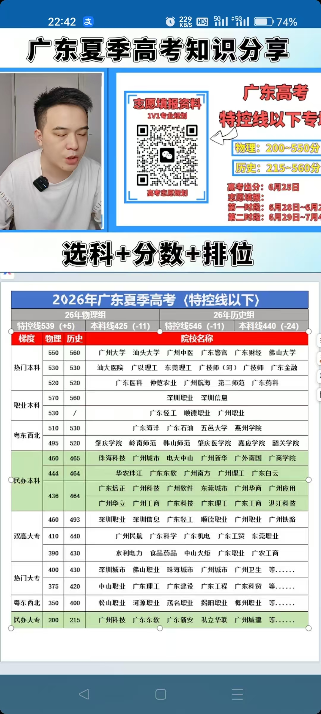

# 专业推荐

计算机类（软件工程（可能比较贵） / 计算机科学与技术 / 网络工程）

电子信息类（电子信息工程 / 通信工程）

电气工程及其自动化

机械类（机械工程、机械设计制造、机械电子工程）

统计学类（统计学、应用统计学）

数学类（数学与应用数学、信息与计算科学）

（仪器类）

~~人工智能 / 大数据技术~~ 需要高学历（985/211）

新能源科学与工程 / 新能源汽车工程  ？？？

智能制造 / 机器人工程

金融学，会计学 / 财务管理  ？？？

电子商务  ？？？

临床医学、口腔医学 ？？？

本科可以好就业
计算机类（软件工程 / 计算机科学与技术）

电子信息类（电子信息工程 / 通信工程）

电气工程及其自动化

***

# 各分段学校推荐

肇庆学院 岭南师范 韩山师范 肇庆医学院 嘉应学院 韶关学院

珠海科技 广州城市 电大中山 广州新华 广外南国 广商学院

广东东软 广州南方 广州理工 广东白云

肇庆学院 岭南师范学院 韩山师范学院 嘉应学院 韶关学院 珠海科技学院 广州城市理工学院 电子科技大学中山学院 广州新华学院 广州商学院 广东东软学院 广州南方学院 广州理工学院 广东白云学院

# 高考志愿填报四大选专业原则总结

1. **优先热爱原则**
   首选自身极度热爱的专业方向，热爱能让工作成为享受；若暂时没有明确热爱十分正常，可先拓宽认知再发掘兴趣。参考案例：饺子、冯骥、蓝哥等从业者均因热爱深耕对应领域。
2. **多选路兜底原则**
   无明确喜好时，优先选择就业、升学出路更广的专业；文科推荐汉语言，理科推荐计算机，保留未来发展选择权。
3. **专业方向统一原则**
   不同专业对应完全不同人生发展路径，填报志愿集中同一大类专业，切忌跨大类杂乱填报：
   - 分散填报会丧失专业选择主动权；
   - 统一大类填报，冲稳保所有录取层次都能留在目标专业赛道。
4. **优选热门赛道原则**
   优先大众热门专业，避开过于小众的专业，拓宽就业与发展渠道。

***

# 稳定，可以考虑 专科定向

***

好就业

铁道铁路

***

01 02 03
陷阱一：误填高收费专业
广东省《高考指南》，专业名称相同，但一个普通专业，一个高收费
中外合办专业，整体
不推荐冲，除非你原本就有留学的规划
陷阱二：阝
院校代码相同，
业本科，一个是普通本科　
但一个是职
陷阱三：学校招生办的承诺
不要听信招生办的一面之词，哪怕签协议，写招生计划也没，用
还是要基于报考、录取逻辑，进行填报

***

民办本科 vs 公办专科
能负担20\~30万且录到好民办好专业（如珠海科技等部分专业）→可考虑民办本科。
否则优先公办专科王牌专业（双高计划：深职大、广轻、广铁等），成本低就业不差。
若民办录到冷门差专业且就业无保障→不如公办专科。

***

AI与行业方向简介（理工补充）
底层研究层：数学/统计/应用数学（建议985/读博）
核心能力层：计算机科学与技术（地基）
工程实现层：软件工程、网络工程、物联网
智能应用层：人工智能、数据科学与大数据
行业落地：信息安全、数字媒体等
内向喜钻研男生→网络工程/后端开发较匹配。

----------------

# 确定专业选择的几大原则

原则一：选定一个自己极致热爱的专业方向高于一切其他原

原则二：选择出路相对较多的专业

原则三：尽量填报一个统一的大专业方向

原则四：选择相对热门的专业，而不是小众专业